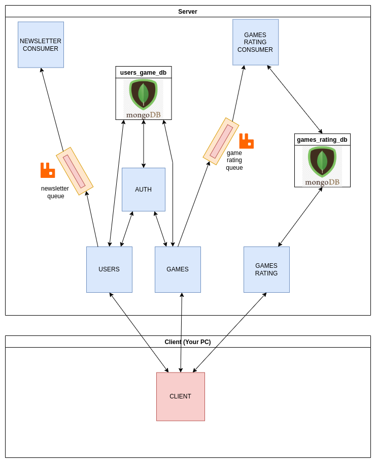

## Microservice with framework Flask
Synchronous communication between microservices.
I used a requests library to communicate between services.



## Usage
Command to run application
```bash
docker-compose up --build -d
```

## License

[](https://opensource.org/licenses/MIT)  
